# BodyConquest
# Preview

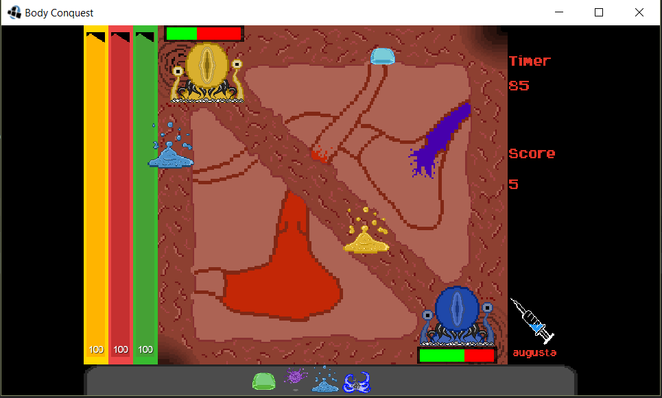

A multiplayer strategy game with elements of AI, physics and networking. Built with Java and PostgreSQL. Two different diseases compete against each other to be the one who ultimately takes over the human body. It is called Body Conquest. All art is custom made for this game.

## Example Player Units:

| White Blood Cell                      | Tank Virus                     | Ranged Damage Bacteria           | Boss                      |
| ------------------------------------- | ------------------------------ | -------------------------------- | ------------------------- |
| 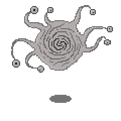 | 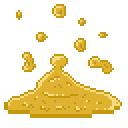 |  | 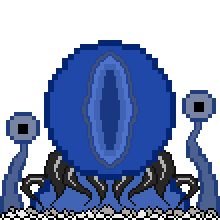 |

## Example Maps:

### Mouth
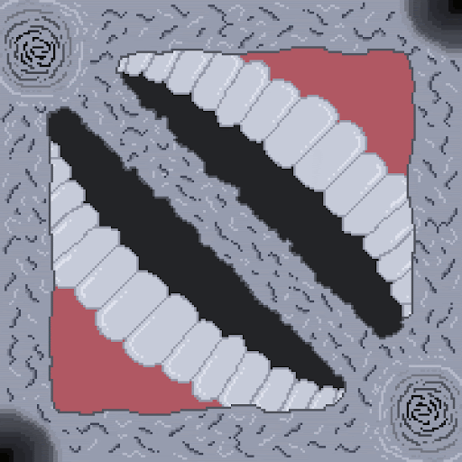
### Eyes
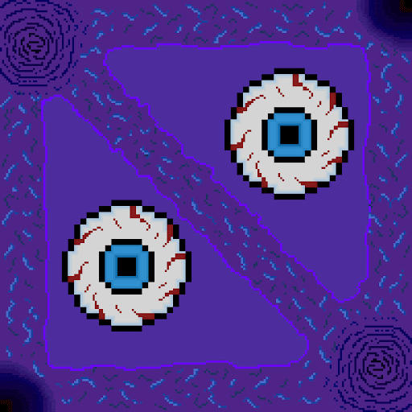
### Heart
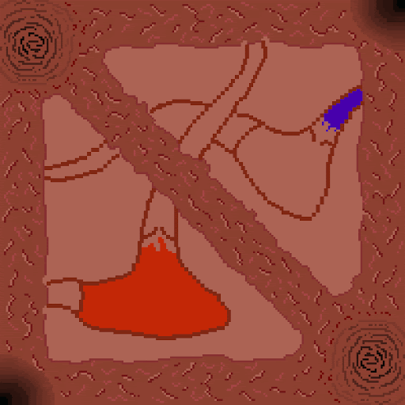

# Player Journey

When a user starts the game, they are directed to the main menu screen

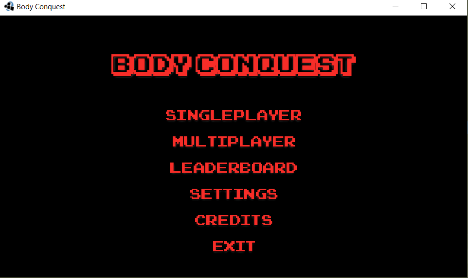

Here they can select the game type they'd like to play. Once they've selected, they are propted to choose which disease they'd like to play as from a choice of 3.

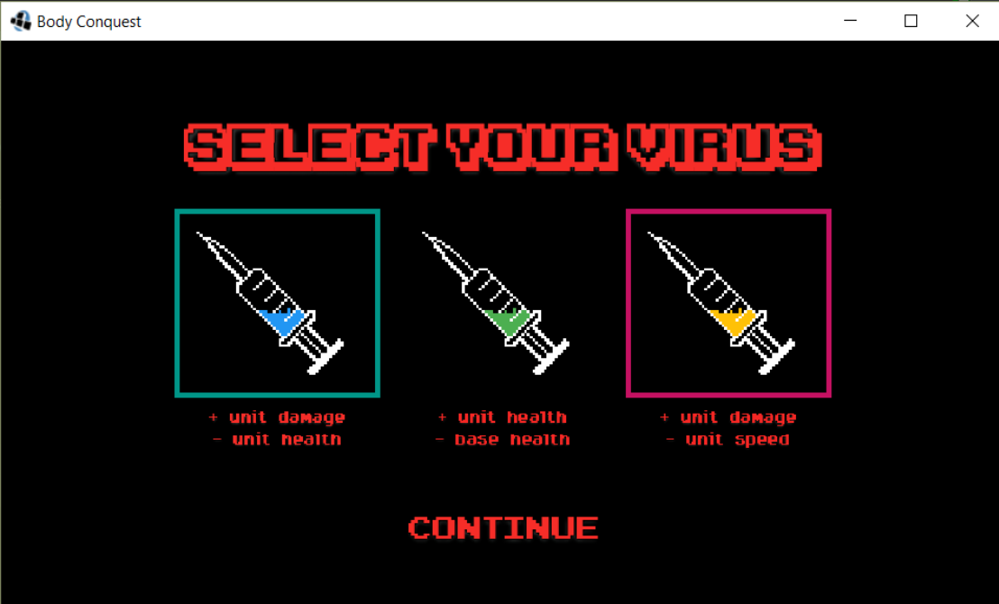

Then the user selects which organ to conquer. Each organ has points associated with it, and at the end the player with the most points wins.

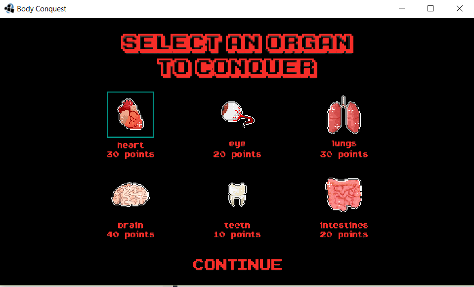

Then, the encounter takes place. The user selects which unit to drag and drop onto one of the three lanes on the map. Each unit requires a combination of the three replenishable resources: Protein, Carbs and Fats. These can be tracked using the bars on the left side of the screen.

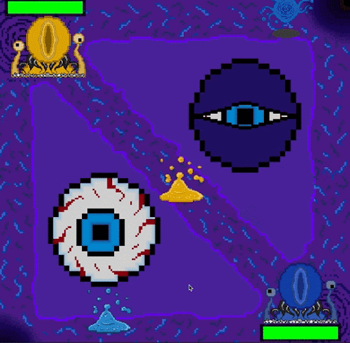

The units will slowly advance from the player's corner to the opponent's corner on the chosen lane. When the units reach the enemy boss, they start dealing damage. The round is won when the enemy boss dies, or when the timer ends. In this case, the winner is the player with the boss that has more health.

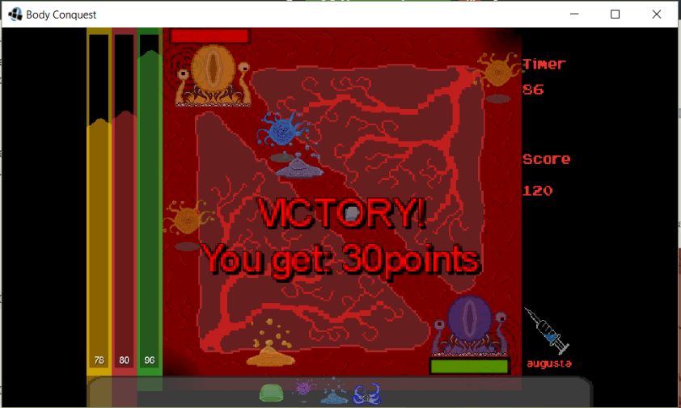

The points are then added to the Leaderboard. These scores are stored in the database.

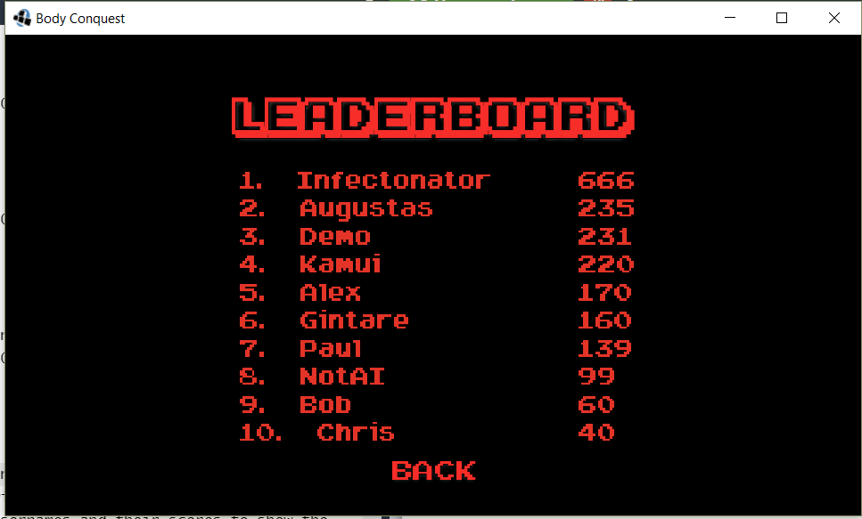

# Description

This is a team project of 5 agile developers to create a competitive game with the elements of artificial intelligence, physics and networking. After careful consideration, we decided to build a top-down, multiplayer strategy game in which two different diseases compete against each other to be the one who ultimately takes over the human body. It is called Body Conquest.

Intuitive game-play, complex combat system, short battle times and the multiplayer
mode make sure that the user does not get bored quickly. Moreover, single player
implementation allows a user to play in a more casual setting, without another person,
in order to practice new strategies and tactics. When playing against the AI controlled
opponent, the user can improve his or her skills even when their friends are not around
which makes the game much more flexible. Furthermore, we wanted to make sure we
create an immersive experience and thus put a lot of emphasis on the visuals. Many
different, original and beautiful textures of maps and troops make the gaming experi-
ence even more enjoyable while making the game more appealing.

#  Game Design
## Winning Conditions

Body Conquest has two winning types: 
- Winning an encounter

The player wins an encounter when he or she destroys opponent's base or when the time has run out and their base has more health than their opponent's.

- Winning full game

The player wins the game after all 6 organs have been captured and a player accu- mulated more points than the opponent. Points are gained for killing troops and capturing the organs. Capturing an organ is achieved by winning an encounter.

## Races/Diseases

We decided on 3 disease options that a player could chose to play as:

### Influenza

Description: Influenza is the perfect disease for the player that likes spawning units constantly. It is specically designed to give the user the ability to control the map by summoning multiple units with the least amount of resources. The user can strategi- cally place this units as guards to the base, or even use them oensively by ooding all lanes before the opponent even has time to think about the next move. They also gain the ability to slow their foes, further enforcing the idea of controlling the map with their units.

Ability:

Rigor Mortis - Slows down all the enemies in the chosen lane for a period of time. Strengths:

- Cheaper units relative to all other diseases.

Weaknesses:

- All units have reduced health.

Strategy:

The user has access to two possible strategies:

Defensive: The user can use their power of constantly spawning units in or- der to defence the base as much as possible. Since they still have the ability to choose between all three units, a skilled user would minmax their gameplay by getting the right type of minion on the right lane.

Ofensive: The power of the user lies in numbers. Therefore, though signi- cantly weaker, the user's units can group up and form a powerful oensive against both the tankier opponent units, as well as opponent base.

Stats:

- Base Health : 1000
- Unit speed multiplier: 1.3
- Unit health multiplier: 0.75
### Measles

Description: Measles is the disease designed for users who enjoy controlling constant, powerful minions. Their units will be the tankiest out of all other diseases, giving the user the means of protecting their base. They will need to do so, as their base is the weakest compared to other diseases.

Ability:

Necrosis: For a very high cost, destroy all enemies in the immediate vicinity of your base.

Strengths:

- The units have signicantly increased health.

Weaknesses:

- The base has signicantly decreased health.

Strategy:

The user is bound to play defensively, as their base is very easily conquerable. Mak- ing sure that all lanes have a unit on them is essential to avoid a loss. Oensive play is still possible, especially on lanes populated by weaker opponent units, or no units at all. The user must also make sure that they do not spend their resources fully, in order to make sure they can always quickly spawn a unit to protect the base in the case of a surprise attack.

Stats:

- Base Health : 75
- Unit health multiplier: 1.4
- Tank range: 100
### Rotavirus

Description: Rotavirus is the aggressive disease, perfect for players who like playing oensively. Although slower, all units are more powerful, intimidating any opponent. Their units can singe-handedly eliminate multiple opponent units. Their base is quite powerful as well, providing the opportunity to even ignore some opponent units in the last case scenario, in order to assure some units reach the opponent base and annihilate it just in time. This is further enforced by their ability, being able to rarely completely forget about the defensive and only concentrate on the oensive.

Ability:

Necrosis: For a very high cost, destroy all enemies in the immediate vicinity of your base.

Strengths:

- All units have signicantly increased damage.

Weaknesses:

- All units are slower.

Strategy:

The main weapon of this disease is its Fungus (tank) unit. It will become a unit with both a great amount of health, as well as a great amount of damage. The user can take advantage of this unit as much as possible to both destroy enemy units, as well as defend the base, if necessary. Another strategy the user can adopt is winning a game very fast, by spawning as many high damage units as much as possible and not care about defensive at all, trying to conquer the enemy base at the very start of the encounter, before the opponent gets to reach theirs.

Stats:

- Base Health : 1000
- Unit health multiplier: 0.7
## Units

We created our 3 main units:

### 1. Fungus (Tank)

| Disease   | DPS | Health | Speed | Range | Cost: Sugar | Cost: Protein | Cost: Lipid |
| --------- | --- | ------ | ----- | ----- | ----------- | ------------- | ----------- |
| Inuenza   | 45  | 187    | 80    | 50    | 20          | 15            | 40          |
| Measles   | 45  | 350    | 60    | 110   | 20          | 20            | 50          |
| Rotavirus | 55  | 100    | 40    | 50    | 20          | 20            | 50          |

The most reliable unit for defending one's base, a tenacious unit with a formidable health pool.

### 2. Bacteria (Melee)

| Disease   | DPS | Health | Speed | Range | Cost: Sugar | Cost: Protein | Cost: Lipid |
| --------- | --- | ------ | ----- | ----- | ----------- | ------------- | ----------- |
| Inuenza   | 30  | 75     | 130   | 50    | 10          | 25            | 15          |
| Measles   | 30  | 140    | 100   | 50    | 10          | 30            | 20          |
| Rotavirus | 30  | 100    | 70    | 50    | 10          | 30            | 20          |

An efective unit, capable of inicting considerable amounts of damage for a relatively low cost.

### 3. Virus (Ranged)

| Disease   | DPS | Health | Speed | Range | Cost: Sugar | Cost: Protein | Cost: Lipid |
| --------- | --- | ------ | ----- | ----- | ----------- | ------------- | ----------- |
| Inuenza   | 13  | 52     | 256   | 200   | 60          | 35            | 20          |
| Measles   | 13  | 98     | 200   | 200   | 80          | 30            | 20          |
| Rotavirus | 13  | 70     | 140   | 200   | 80          | 30            | 20          |

Capable of single-handedly taking down units and bases alike from a distance, the virus is an important tool in any player's arsenal.